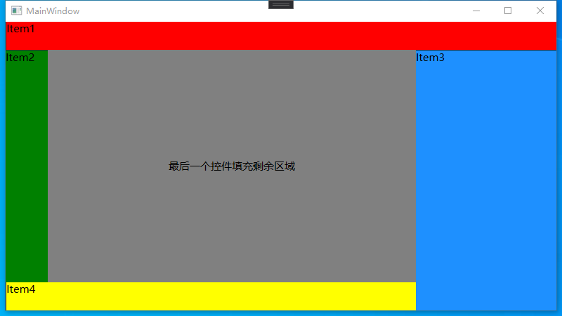
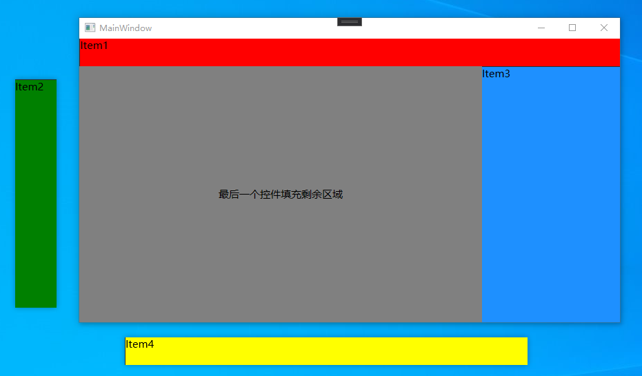
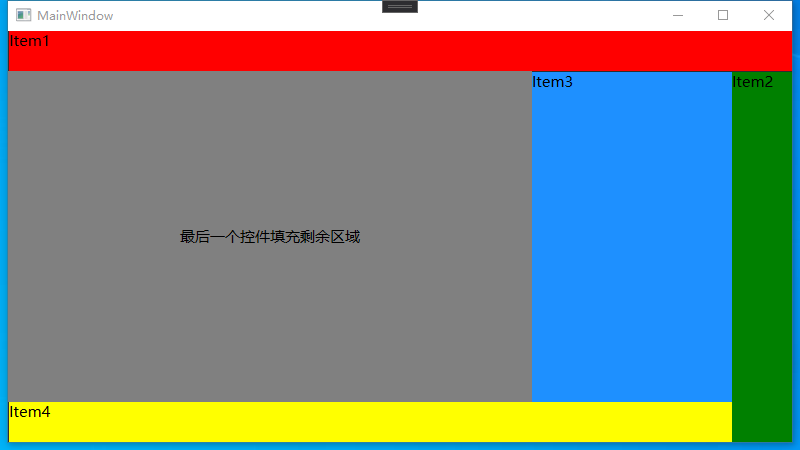

# SeparablePanel
[WPF控件] 可分离出原窗口的面板控件

## 截图







## 原理

DockPanel面板可以让子控件在它的边上停靠，最后一个子控件填充剩余空间。拖拽分离时将控件从DockPanel移除，然后添加进子窗口中。

## 使用方法

需要将SeparablePanel和SeparablePanelItem结合使用。SeparablePanel继承自DockPanel，SeparablePanelItem继承自StackPanel。示例：

```xml
<wpf_control:SeparablePanel>
    <wpf_control:SeparablePanelItem DockPanel.Dock="Top" Height="40" Orientation="Horizontal" Background="Red">
        <TextBlock Text="Item1" FontSize="15"/>
    </wpf_control:SeparablePanelItem>
    <wpf_control:SeparablePanelItem DockPanel.Dock="Right" Width="60" Background="Green">
        <TextBlock Text="Item2" FontSize="15"/>
    </wpf_control:SeparablePanelItem>
    <Border Background="Gray">
        <TextBlock Text="最后一个控件填充剩余区域" FontSize="15" HorizontalAlignment="Center" VerticalAlignment="Center"/>
    </Border>
</wpf_control:SeparablePanel>
```

拖拽SeparablePanelItem的头部即可从原窗口中分离。头部的宽度或高度默认为1像素，鼠标进入时将展开。

### 注意点

* 需要为SeparablePanelItem设置停靠位置，即DockPanel.Dock属性。
* SeparablePanelItem的Orientation决定了头部的方向，当Orientation为Vertical时需要设置宽度，为Horizontal时需要设置高度。

## SeparablePanelItem的属性、方法和事件

### 属性

`IsShowHeader`：是否显示头部。

`IsHide`：是否隐藏。为false时无论SeparablePanelItem在原窗口或者在子窗口都将隐藏。

### 方法

`bool Back(int index)`：将SeparablePanelItem从子窗口返回原窗口。index为插入到SeparablePanel的索引，范围为[0,SeparablePanel.Children.Count-1]。返回值为true则成功，否则失败。如果SeparablePanelItem已经在原窗口或index超出范围都将失败。

### 事件

`MoveOut`：当SeparablePanelItem从原窗口中分离时发生。

`Move`：当SeparablePanelItem所在的子窗口移动时发生

`MoveIn`：当SeparablePanelItem从子窗口返回原窗口时发生。